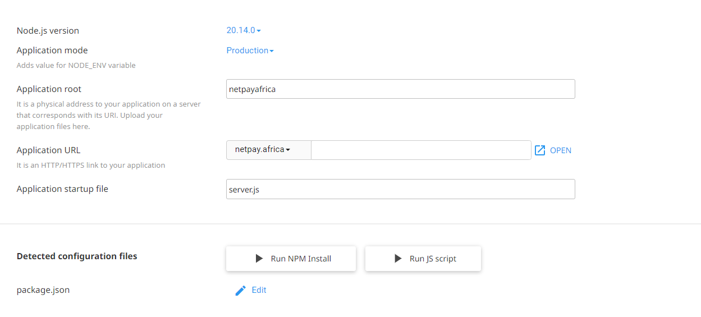

Installing NextJs files on Cpanel

Note: Before deploying your App on Cpanel, the cpanel must support Nodejs 

1. Firstly local run `npm install`
2. After success run `npm run build`
3. Zip all file except the `node_modules` folder
4. Check your App Node version using this `node -v` so we can use it on the liveserver

When you get to your Cpanel, Locate Setup `Node.js App`

After following the above go to terminal on your cpanel to install express on your virtual server

`source /home/netpgokf/nodevenv/netpayafrica/20/bin/activate && cd /home/netpgokf/netpayafrica`

using this `npm install express`

